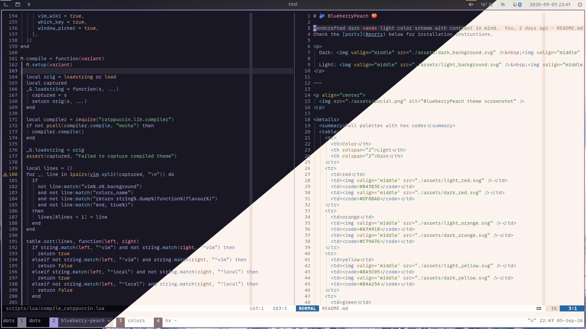
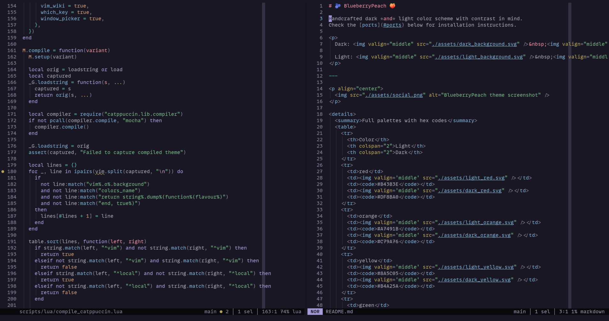
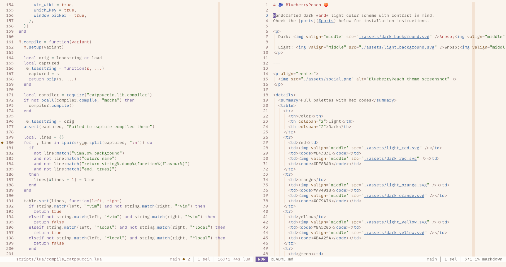

# 🫐 BlueberryPeach 🍑

Handcrafted dark *and* light color scheme with contrast in mind.
Check the [ports](#ports) below for installation instructions.

  Dark: &nbsp;&nbsp;&nbsp;&nbsp;&nbsp;&nbsp;&nbsp;&nbsp;&nbsp;

  Light: &nbsp;&nbsp;&nbsp;&nbsp;&nbsp;&nbsp;&nbsp;&nbsp;&nbsp;

---

  

  
Full palettes with hex codes

  <table>
    <tr>
      <th>Color</th>
      <th colspan="2">Light</th>
      <th colspan="2">Dark</th>
    </tr>
    <tr>
      <td>red</td>
      <td></td>
      <td><code>#B43B3E</code></td>
      <td></td>
      <td><code>#DF8BA0</code></td>
    </tr>
    <tr>
      <td>orange</td>
      <td></td>
      <td><code>#9A5518</code></td>
      <td></td>
      <td><code>#C79A76</code></td>
    </tr>
    <tr>
      <td>yellow</td>
      <td></td>
      <td><code>#807000</code></td>
      <td></td>
      <td><code>#C7B96F</code></td>
    </tr>
    <tr>
      <td>green</td>
      <td></td>
      <td><code>#247500</code></td>
      <td></td>
      <td><code>#75B087</code></td>
    </tr>
    <tr>
      <td>teal</td>
      <td></td>
      <td><code>#017468</code></td>
      <td></td>
      <td><code>#5EB1AF</code></td>
    </tr>
    <tr>
      <td>blue</td>
      <td></td>
      <td><code>#2169A6</code></td>
      <td></td>
      <td><code>#7AA8CE</code></td>
    </tr>
    <tr>
      <td>violet</td>
      <td></td>
      <td><code>#6F58A2</code></td>
      <td></td>
      <td><code>#A19DD4</code></td>
    </tr>
    <tr>
      <td>pink</td>
      <td></td>
      <td><code>#A5407B</code></td>
      <td></td>
      <td><code>#C394C2</code></td>
    </tr>
    <tr>
      <td>text</td>
      <td></td>
      <td><code>#6B635C</code></td>
      <td></td>
      <td><code>#A2A2A9</code></td>
    </tr>
    <tr>
      <td>subtext</td>
      <td></td>
      <td><code>#746E68</code></td>
      <td></td>
      <td><code>#878794</code></td>
    </tr>
    <tr>
      <td>overlay2</td>
      <td></td>
      <td><code>#857F79</code></td>
      <td></td>
      <td><code>#7D7D7D</code></td>
    </tr>
    <tr>
      <td>overlay1</td>
      <td></td>
      <td><code>#8A847D</code></td>
      <td></td>
      <td><code>#808084</code></td>
    </tr>
    <tr>
      <td>overlay0</td>
      <td></td>
      <td><code>#8F8982</code></td>
      <td></td>
      <td><code>#84848C</code></td>
    </tr>
    <tr>
      <td>dimmed</td>
      <td></td>
      <td><code>#8B6E6E</code></td>
      <td></td>
      <td><code>#7C7992</code></td>
    </tr>
    <tr>
      <td>surface1</td>
      <td></td>
      <td><code>#F3E2D3</code></td>
      <td></td>
      <td><code>#353144</code></td>
    </tr>
    <tr>
      <td>background</td>
      <td></td>
      <td><code>#FAF4ED</code></td>
      <td></td>
      <td><code>#191724</code></td>
    </tr>
    <tr>
      <td>surface0</td>
      <td></td>
      <td><code>#FEFDFB</code></td>
      <td></td>
      <td><code>#08090C</code></td>
    </tr>
</table>

## Goals

- Legible light *and* dark mode
- Sufficient [contrast](https://www.w3.org/WAI/WCAG21/Understanding/contrast-minimum.html) in most cases
- Uniform contrast between colors and backgrounds
- As high a [color difference](https://en.wikipedia.org/wiki/Color_difference#CIELAB_%CE%94E*) between colors as possible (while keeping uniform contrast in mind)

## Screenshots

  
neovim

  

    
    
  

  
helix

  

    
    
  

## Ports

Terminal:

- [neovim](./ports/neovim)
- [helix](./ports/helix)
- [tmux](./ports/tmux)
- [fzf](./ports/fzf)
- [bat](./ports/bat)
- [lazygit](./ports/lazygit)
- [yazi](./ports/yazi)
- [zsh helix mode](./ports/zsh_helix_mode)
- [zsh syntax highlighting](./ports/zsh_syntax_highlighting)

Graphical:

- [sway](./ports/sway)
- [swaylock](./ports/swaylock)
- [ghostty](./ports/ghostty)
- [wezterm](./ports/wezterm)
- [Waybar](./ports/waybar)
- [fuzzel](./ports/fuzzel)
- [mako](./ports/mako)
- [slack](./ports/slack)
- vivaldi browser
  - [Light](https://themes.vivaldi.net/themes/V6kJNwMp7WX)
  - [Dark](https://themes.vivaldi.net/themes/okQlZoM3vDX)
- [windows terminal](./ports/windows_terminal)

## Standing on the shoulders of giants

The color schemes are based on and/or utilize code from the following projects:

- [Catppuccin](https://github.com/catppuccin/catppuccin)
- [Rosé Pine](https://github.com/rose-pine/rose-pine-theme)
