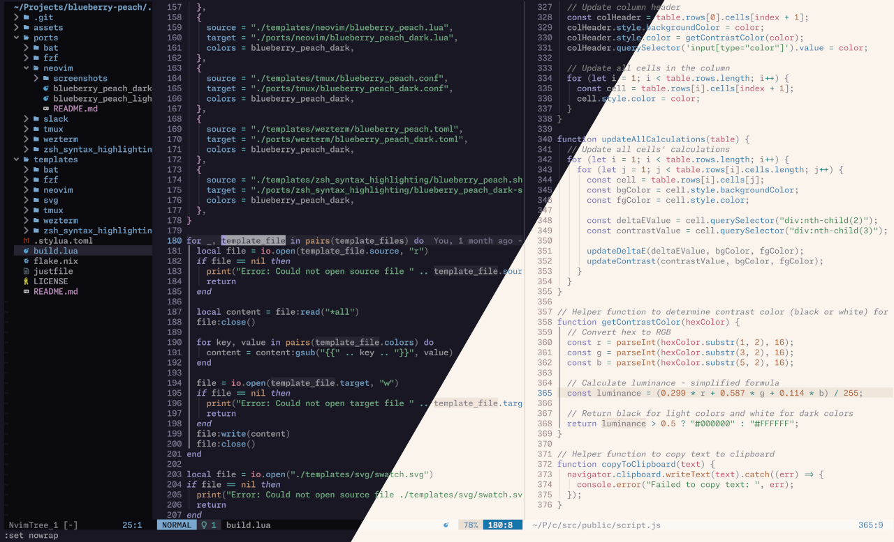
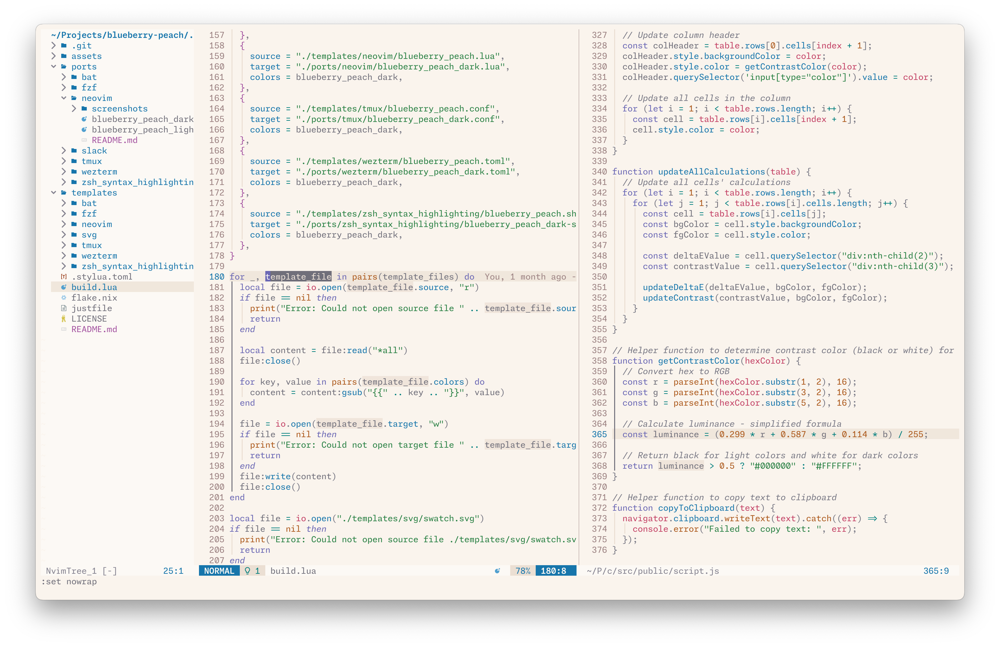

# 🫐 BlueberryPeach 🍑

Light and dark color scheme for neovim and the terminal.

See below for [palette](#palette) and [ports](#ports).

  

## Screenshots

neovim

  

    
    
  

## Palette

<table>
  <tr>
    <th>Color</th>
    <th colspan="2">Light</th>
    <th colspan="2">Dark</th>
  </tr>
  <tr>
	<td>red</td>
    <td></td>
    <td><code>#C34165</code></td>
    <td></td>
    <td><code>#DF8BA0</code></td>
  </tr>
  <tr>
	<td>yellow</td>
    <td></td>
    <td><code>#8A7400</code></td>
    <td></td>
    <td><code>#C7B96F</code></td>
  </tr>
  <tr>
	<td>orange</td>
    <td></td>
    <td><code>#AC591C</code></td>
    <td></td>
    <td><code>#C79A76</code></td>
  </tr>
  <tr>
	<td>green</td>
    <td></td>
    <td><code>#288043</code></td>
    <td></td>
    <td><code>#75B087</code></td>
  </tr>
  <tr>
	<td>teal</td>
    <td></td>
    <td><code>#007E7D</code></td>
    <td></td>
    <td><code>#5EB1AF</code></td>
  </tr>
  <tr>
	<td>blue</td>
    <td></td>
    <td><code>#1675AB</code></td>
    <td></td>
    <td><code>#7AA8CE</code></td>
  </tr>
  <tr>
	<td>violet</td>
    <td></td>
    <td><code>#6A67B4</code></td>
    <td></td>
    <td><code>#A19DD4</code></td>
  </tr>
  <tr>
	<td>pink</td>
    <td></td>
    <td><code>#A352A0</code></td>
    <td></td>
    <td><code>#A19DD4</code></td>
  </tr>
  <tr>
	<td>text</td>
    <td></td>
    <td><code>#5B5B5B</code></td>
    <td></td>
    <td><code>#A2A2A9</code></td>
  </tr>
  <tr>
	<td>subtext</td>
    <td></td>
    <td><code>#908A84</code></td>
    <td></td>
    <td><code>#878794</code></td>
  </tr>
  <tr>
	<td>overlay2</td>
    <td></td>
    <td><code>#707070</code></td>
    <td></td>
    <td><code>#7D7D7D</code></td>
  </tr>
  <tr>
	<td>overlay1</td>
    <td></td>
    <td><code>#646464</code></td>
    <td></td>
    <td><code>#808084</code></td>
  </tr>
  <tr>
	<td>overlay0</td>
    <td></td>
    <td><code>#585858</code></td>
    <td></td>
    <td><code>#84848C</code></td>
  </tr>
  <tr>
	<td>dimmed</td>
    <td></td>
    <td><code>#9C8282</code></td>
    <td></td>
    <td><code>#7C7992</code></td>
  </tr>
  <tr>
	<td>surface2</td>
    <td></td>
    <td><code>#E8DFD4</code></td>
    <td></td>
    <td><code>#2D2B37</code></td>
  </tr>
  <tr>
	<td>surface1</td>
    <td></td>
    <td><code>#F1ECE5</code></td>
    <td></td>
    <td><code>#2D2B37</code></td>
  </tr>
  <tr>
	<td>background</td>
    <td></td>
    <td><code>#FAF4ED</code></td>
    <td></td>
    <td><code>#191724</code></td>
  </tr>
  <tr>
	<td>surface0</td>
    <td></td>
    <td><code>#FFFAF0</code></td>
    <td></td>
    <td><code>#0B0A0F</code></td>
  </tr>
</table>

## Ports

- [neovim](./ports/neovim)
- [tmux](./ports/tmux)
- [fzf](./ports/fzf)
- [bat](./ports/bat)
- [zsh syntax highlighting](./ports/zsh_syntax_highlighting)
- [wezterm](./ports/wezterm)
- [slack](./ports/slack)

## Standing on the shoulders of giants

The color schemes are based on and/or utilize code from the following projects:

- [Catppuccin](https://github.com/catppuccin/catppuccin)
- [Rosé Pine](https://github.com/rose-pine/rose-pine-theme)
