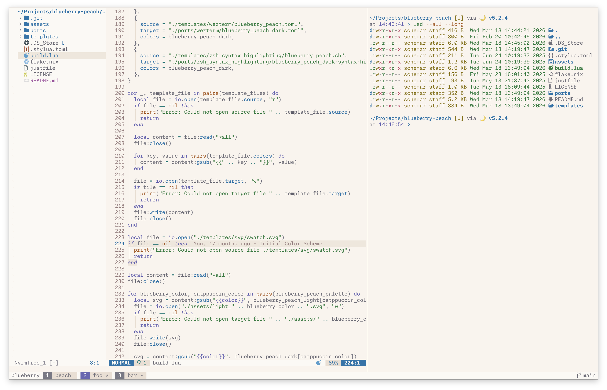
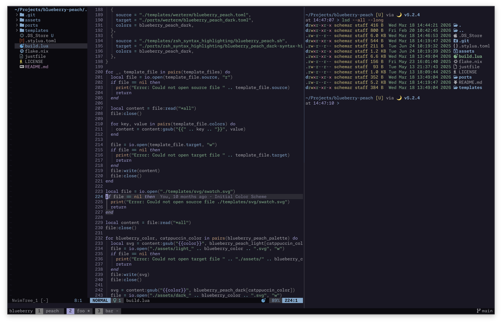

# 🫐 neovim 🍑

BlueberryPeach for [neovim](https://github.com/neovim/neovim).

Based on, but does not require [catppuccin/nvim](https://github.com/catppuccin/nvim).
Supports almost all integrations that catppuccin includes.

<p align="center">
  
  
</p>

## Installation

1. Clone blueberry peach
2. Symlink the color scheme into neovim:
   ```bash
   mkdir -p ~/.local/share/nvim/site/pack/themes/start
   ln -s /path/to/blueberry-peach/ports/neovim ~/.local/share/nvim/site/pack/themes/start/blueberry-peach
   ```
3. Set the colorscheme in your `init.lua`:
   ```lua
   vim.cmd([[colorscheme blueberry-peach]])
   ```
4. (Optional) Set the colorscheme for [lualine](https://github.com/nvim-lualine/lualine.nvim):
   ```lua
   require('lualine').setup({
     options = {
        theme = 'blueberry-peach'
     }
   })
   ```
