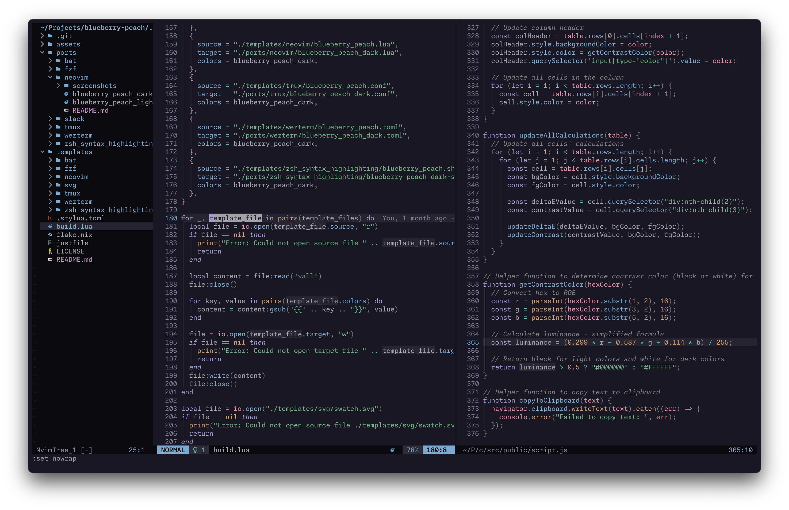

# 🫐 neovim 🍑

BlueberryPeach for [neovim](https://github.com/neovim/neovim).

Requires [catppuccin/nvim](https://github.com/catppuccin/nvim).

<p align="center">
  
  
</p>

## Installation

The process is always the same, independent from the plugin manager you use.

1. Install [catppuccin/nvim](https://github.com/catppuccin/nvim).
2. Copy the `.lua` files from this directory into your `~/.config/nvim/lua` directory or somewhere else from where you want to `require` it with `nvim`.
   - Alternatively, you can clone this repository and symlink the files.
3. `require` BlueberryPeach's `.lua` file in your config to override a catppuccin flavor.
4. Set the catppuccin flavor.

> [!WARNING]
> I recommend not overwriting catppuccin's `latte` flavor, as it handles some special cases differently from the other flavors.
> You can override any other flavour with BlueberryPeach's light and dark variants.

### Generic Example

```lua
-- Configure catppuccin as per usual. Note that the `flavour` is set to `frappe` here.
local catppuccin_opts = {
  flavour = "frappe", -- If overriding `frappe` below. See `config`.
  -- Rest of catppuccin options ...
}

-- Require blueberry_peach_light or blueberry_peach_dark to override catppuccin's flavor.
-- For that, use the provided `get_overrides` function.
local blueberry_peach_light = require("path.to.blueberry_peach_light") -- Adjust the path accordingly
local blueberry_peach_overrides = blueberry_peach_light.get_overrides("frappe")
-- Alternative, if you want to override any flavour:
-- local blueberry_peach_overrides = blueberry_peach_light.get_overrides(catppuccin_opts.flavour)

-- Merge the overrides with the catppuccin options.
catppuccin_opts = vim.tbl_deep_extend("force", catppuccin_opts, blueberry_peach_overrides)

-- Setup catppuccin with the merged options.
require("catppuccin").setup(catppuccin_opts)
vim.cmd([[colorscheme catppuccin]])
```

### [lazy.nvim](https://github.com/folke/lazy.nvim) Example

```lua
{
  "catppuccin/nvim",
  name = "catppuccin",
  priority = 1000,
  lazy = false,
  opts = {
    flavour = "frappe", -- If overriding `frappe` below. See `config`.
    -- Rest of catppuccin options ...
  },
  config = function(_, opts)
    -- Extend with overrides for BlueberryPeach theme
    local blueberry_peach_light = require("path.to.blueberry_peach_light") -- Adjust the path accordingly
    opts = vim.tbl_deep_extend("force", opts, blueberry_peach_light.get_overrides("frappe"))

    require("catppuccin").setup(opts)
    vim.cmd([[colorscheme catppuccin]])
  end,
},
```
