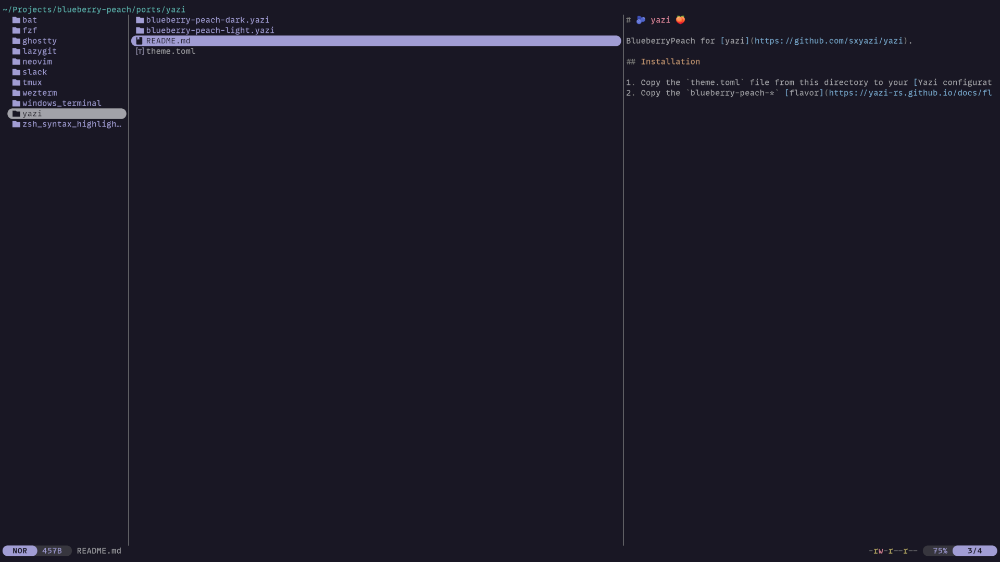
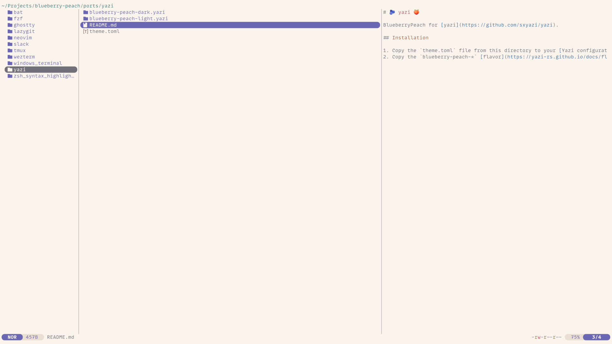

# 🫐 yazi 🍑

BlueberryPeach for [yazi](https://github.com/sxyazi/yazi).

  
  

## Installation

1. Copy the `theme.toml` file from this directory to your [Yazi configuration directory](https://yazi-rs.github.io/docs/configuration/overview).
2. Copy the `blueberry-peach-*` [flavor](https://yazi-rs.github.io/docs/flavors/overview) directories from this directory to your [Yazi configuration directory](https://yazi-rs.github.io/docs/configuration/overview).
